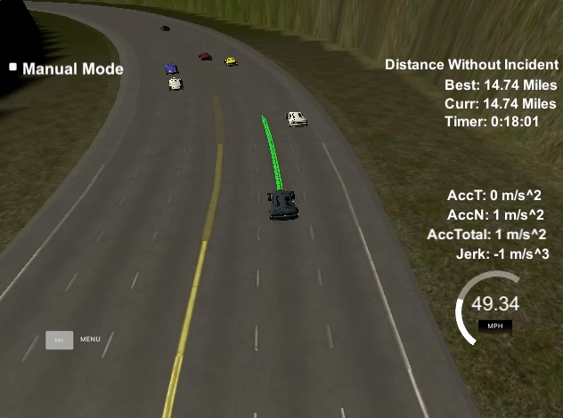
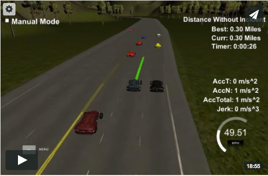

# CarND-Path-Planning-Project
Self-Driving Car Engineer Nanodegree Program

### Introduction

In this project my goal was to navigate safely a car on a virtual highway. There were given track coordinates and sensor fusion data about other vehicles. 

The car had to drive without any accident for at least 4.32 miles, do not exceed speed limit of 50 MPH, do not exceed max acceleration and jerk rates, not make any collisions, stay in the lane and be able to change them in a smooth way.

### Implemented Solution

Main idea used for this project was development of Finite State Machine algorithm which could make decisions in dynamic environment. There are 3 main steps in code which I have implemented in order to separate logically different aspects of the planner:

1. Sensor fusion data analysis - to generate higher level informations about serrounding vehicles and future predictions about them.

2. Behaviour planning - to decide how to behave in order to drive safely, meet thresholds and pass other vehicles.

3. Calculate driving trajectory for changing the lanes in a smooth way.

Whole solution was implemented in one class named "PathPlanner". All parameters where defined as constant variables to give clear overview what could be tweaked in order to change behaviour of the planner. The planner is used in the code template from Udacity in just few lines in the "main.cpp" file.

Planner is initialised once, variables describing track are set and the object is passed to the "onMessage" method. Planner's instance method "getNextWayPoints" is invoked to plan next way points in map's coordinates for the next 0.02s. In every invoked call data about the vehicle state, sensor fusion data (other vehicles) and previous path is passed.

The incoming data is used to calculate speed and relative positions of other vehicles based on velocity for X and Y axis, and Frenet coordinates. Based on those values I was able to clearly assume few important facts e.g. is current lane free or blocked by other vehicle, is left or right lane available for turning, which lane is better for turning. In order to improve planning, future value of S coordinate in Frenet system was calculated - this solution helped preventing from rare collisions with other vehicles.

I had come up with few rational statements in order to pass by other vehicles and behave safely:

- vehicle should stay and drive in the same lane if it's free
- vehicle should change lane if current lane is blocked
- vehicle should change lane only if there is no car on a side and the space for turning is enough safe
- if other lanes are blocked in close distance, vehicle should follow fastest vehicle with similar speed
- if other lanes are blocked in long distance, vehicle should choose lane, which have an other vehicle in longer distance

This logic was used in behaviour planning step starting from line 133 in "PathPlanner.cpp" file.

After deciding about the behaviour and optional lane change, smooth drive path trajectory was calculated. A really helpful resource for creating smooth trajectories was using, the [spline function](http://kluge.in-chemnitz.de/opensource/spline/) is in a single hearder file. Trajectory calculation starts from line 217 in the "PathPlanner.cpp" file. The smooth spline path was generated from delivered previous path points and calculated 3 points ahead with distance of 30, 60 and 90 meters. Using generated spline I was able to get coordinates with great accuracy in every calculation step to ensure smooth lane transition. Final step was to transform points from Frenet to the map coordinates system and push them back as raw coordinate values outside the planner.

### Results

I was able to meet requirements with a reserver and the car was able to drive on a highway for nearly 15 miles without accidents and exceeding speed and acceleration thresholds. 

<center></center>

The car had to face different road situations and was performing quite well. The counter was resetted because of too long staying in the same lane, so it could still continue driving without accident. Here'a the screencast.

<center>[](https://vimeo.com/231506718 "Path Planner Screencast")</center>

### Conclusion

I had to come a long way until getting to this fairly simple solution, and I think that this area of development is really interesting and challenging. I think my solution is a correct direction, but there is still many more scenarios to cover in order to drive in more efficient, faster and safer way. I will continue expanding my knowledge in this very interesting area.
   
### Simulator. You can download the Term3 Simulator BETA which contains the Path Planning Project from the [releases tab](https://github.com/udacity/self-driving-car-sim/releases).

In this project your goal is to safely navigate around a virtual highway with other traffic that is driving +-10 MPH of the 50 MPH speed limit. You will be provided the car's localization and sensor fusion data, there is also a sparse map list of waypoints around the highway. The car should try to go as close as possible to the 50 MPH speed limit, which means passing slower traffic when possible, note that other cars will try to change lanes too. The car should avoid hitting other cars at all cost as well as driving inside of the marked road lanes at all times, unless going from one current_lane to another. The car should be able to make one complete loop around the 6946m highway. Since the car is trying to go 50 MPH, it should take a little over 5 minutes to complete 1 loop. Also the car should not experience total acceleration over 10 m/s^2 and jerk that is greater than 50 m/s^3.

#### The map of the highway is in data/highway_map.txt
Each waypoint in the list contains  [x,y,s,dx,dy] values. x and y are the waypoint's map coordinate position, the s value is the distance along the road to get to that waypoint in meters, the dx and dy values define the unit normal vector pointing outward of the highway loop.

The highway's waypoints loop around so the frenet s value, distance along the road, goes from 0 to 6945.554.

## Basic Build Instructions

1. Clone this repo.
2. Make a build directory: `mkdir build && cd build`
3. Compile: `cmake .. && make`
4. Run it: `./path_planning`.

Here is the data provided from the Simulator to the C++ Program

#### Main car's localization Data (No Noise)

["x"] The car's x position in map coordinates

["y"] The car's y position in map coordinates

["s"] The car's s position in frenet coordinates

["d"] The car's d position in frenet coordinates

["yaw"] The car's yaw angle in the map

["speed"] The car's speed in MPH

#### Previous path data given to the Planner

//Note: Return the previous list but with processed points removed, can be a nice tool to show how far along
the path has processed since last time. 

["previous_path_x"] The previous list of x points previously given to the simulator

["previous_path_y"] The previous list of y points previously given to the simulator

#### Previous path's end s and d values 

["end_path_s"] The previous list's last point's frenet s value

["end_path_d"] The previous list's last point's frenet d value

#### Sensor Fusion Data, a list of all other car's attributes on the same side of the road. (No Noise)

["sensor_fusion"] A 2d vector of cars and then that car's [car's unique ID, car's x position in map coordinates, car's y position in map coordinates, car's x velocity in m/s, car's y velocity in m/s, car's s position in frenet coordinates, car's d position in frenet coordinates. 

## Details

1. The car uses a perfect controller and will visit every (x,y) point it recieves in the list every .02 seconds. The units for the (x,y) points are in meters and the spacing of the points determines the speed of the car. The vector going from a point to the next point in the list dictates the angle of the car. Acceleration both in the tangential and normal directions is measured along with the jerk, the rate of change of total Acceleration. The (x,y) point paths that the planner recieves should not have a total acceleration that goes over 10 m/s^2, also the jerk should not go over 50 m/s^3. (NOTE: As this is BETA, these requirements might change. Also currently jerk is over a .02 second interval, it would probably be better to average total acceleration over 1 second and measure jerk from that.

2. There will be some latency between the simulator running and the path planner returning a path, with optimized code usually its not very long maybe just 1-3 time steps. During this delay the simulator will continue using points that it was last given, because of this its a good idea to store the last points you have used so you can have a smooth transition. previous_path_x, and previous_path_y can be helpful for this transition since they show the last points given to the simulator controller with the processed points already removed. You would either return a path that extends this previous path or make sure to create a new path that has a smooth transition with this last path.

---

## Dependencies

* cmake >= 3.5
 * All OSes: [click here for installation instructions](https://cmake.org/install/)
* make >= 4.1
  * Linux: make is installed by default on most Linux distros
  * Mac: [install Xcode command line tools to get make](https://developer.apple.com/xcode/features/)
  * Windows: [Click here for installation instructions](http://gnuwin32.sourceforge.net/packages/make.htm)
* gcc/g++ >= 5.4
  * Linux: gcc / g++ is installed by default on most Linux distros
  * Mac: same deal as make - [install Xcode command line tools]((https://developer.apple.com/xcode/features/)
  * Windows: recommend using [MinGW](http://www.mingw.org/)
* [uWebSockets](https://github.com/uWebSockets/uWebSockets)
  * Run either `install-mac.sh` or `install-ubuntu.sh`.
  * If you install from source, checkout to commit `e94b6e1`, i.e.
    ```
    git clone https://github.com/uWebSockets/uWebSockets 
    cd uWebSockets
    git checkout e94b6e1
    ```